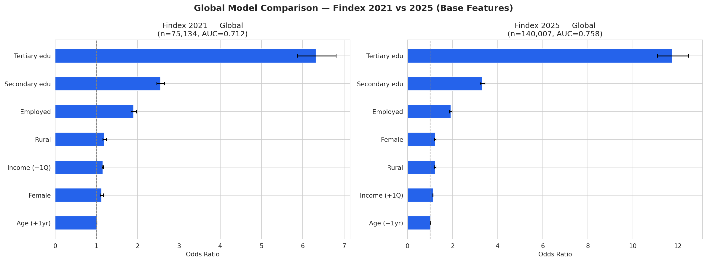
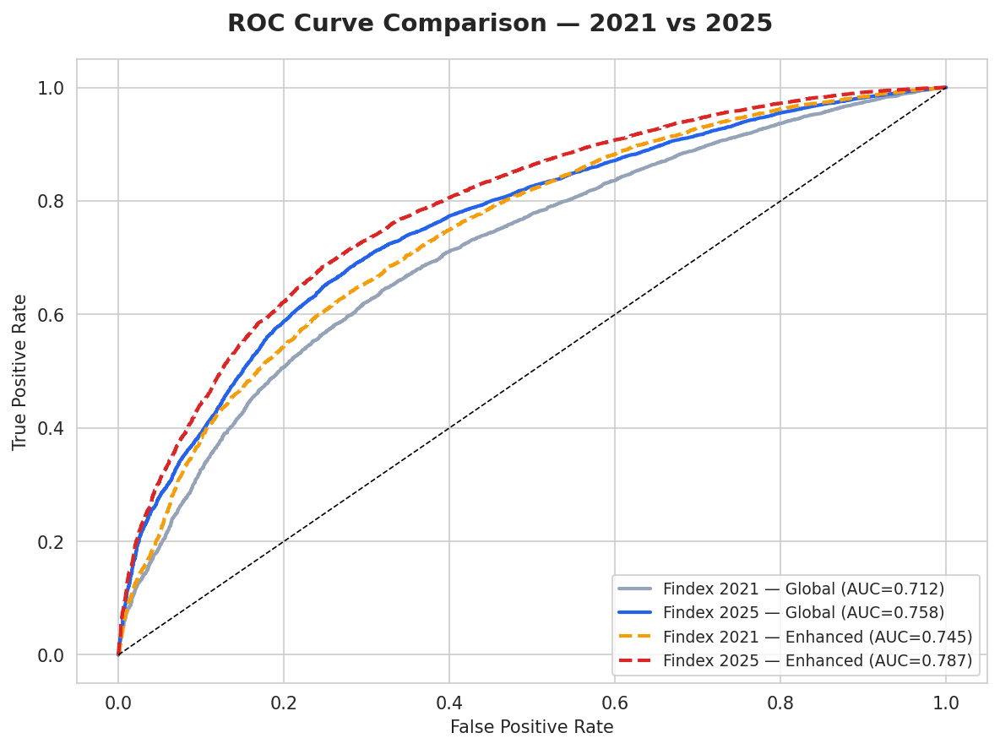
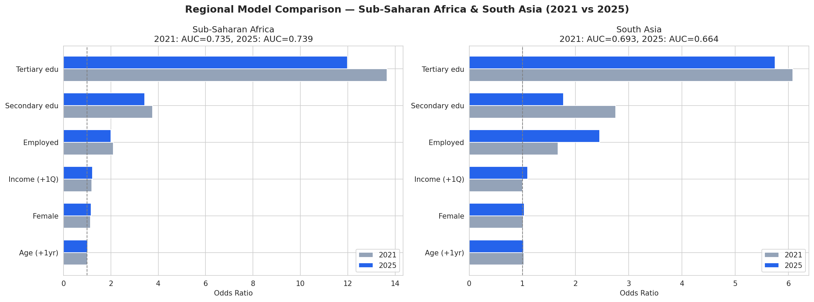
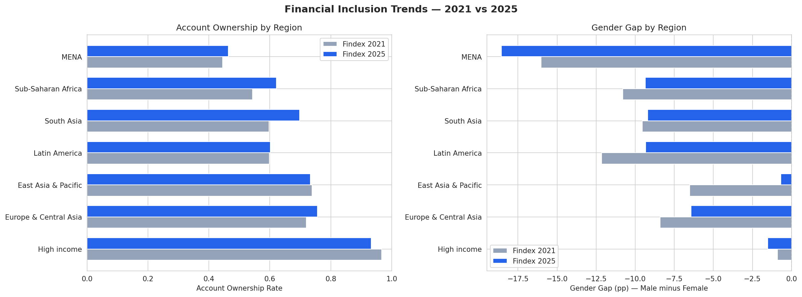
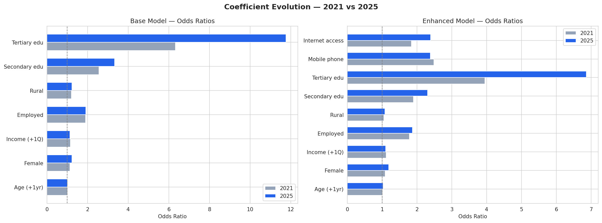

# Findex 2021 vs 2025: Full Coefficient Comparison
## Temporal Analysis of Financial Inclusion Determinants

**Date:** April 2026
**Datasets:** Global Findex 2021 (n = 142,887) and Global Findex 2025 (n = 144,090)
**Script:** `src/findex_2021_comparison.py`

---

## Overview

This report provides the full coefficient-level comparison between the Findex 2021 and 2025 survey rounds, addressing the open recommendation from the extended analysis. Both datasets contain individual-level microdata from World Bank surveys, enabling direct comparison of logistic regression models fitted with identical specifications.

**Key question:** Have the determinants of financial inclusion changed between 2021 and 2025? Are education, employment, and digital access becoming more or less important over time?

---

## 1. Global Model — Base Features

Both models use the same 7 predictors: age, female, income quintile, employed, rural, secondary education, and tertiary education. Primary education is the reference category.

### 1.1 Model Fit

| Metric | Findex 2021 | Findex 2025 | Change |
|---|---|---|---|
| Sample size | 75,134 | 140,007 | +86% |
| Account ownership rate | 53.8% | 73.6% | **+19.8 pp** |
| Pseudo R-squared | 0.098 | 0.148 | +0.050 |
| Accuracy | 65.9% | 75.4% | +9.5 pp |
| ROC-AUC | 0.712 | 0.758 | +0.046 |

**Note on sample sizes:** The 2021 model has fewer observations (75,134 vs 140,007) because the `urbanicity_f2f` (rural/urban) variable was only collected in face-to-face interviews and is missing for 47% of the 2021 sample (phone surveys during COVID-19). All rows with missing values were dropped.

### 1.2 Odds Ratios Comparison

| Predictor | OR (2021) | OR (2025) | Change | Direction |
|---|---|---|---|---|
| Age (+1 year) | 1.014 | **1.023** | +0.009 | Strengthened |
| Female | 1.130 | **1.235** | +0.105 | Strengthened |
| Income quintile (+1) | 1.153 | 1.128 | -0.025 | Slightly weakened |
| Employed | 1.905 | 1.918 | +0.013 | Stable |
| Rural | 1.200 | 1.226 | +0.026 | Stable |
| Secondary education | 2.555 | **3.334** | +0.779 | Strengthened |
| Tertiary education | 6.322 | **11.758** | +5.436 | **Dramatically strengthened** |

All predictors are statistically significant (p < 0.001) in both rounds.

### 1.3 Interpretation

**Education's predictive power has nearly doubled.** Tertiary education increased from OR = 6.3 in 2021 to OR = 11.8 in 2025 — individuals with university education are now almost 12 times more likely to hold a financial account compared to those with only primary education, up from 6 times in 2021. Secondary education followed a similar pattern (OR: 2.6 to 3.3).

This strengthening does not necessarily mean education became more important — it likely reflects that as overall account ownership grew from 54% to 74%, the remaining unbanked population is increasingly concentrated among those with low education. Education has become more *discriminating* because the "easy wins" (educated people who previously lacked accounts) have already been included.

**Age has become a stronger predictor** (OR: 1.014 to 1.023). Over a 30-year age span, this compounds from 1.5x in 2021 to 2.0x in 2025. As financial services expand, younger cohorts may face new barriers (lack of employment history, credit scores) while older cohorts benefit from accumulated economic participation.

**Employment remains the second-strongest predictor** after education, stable at roughly OR = 1.9 in both rounds. This stability suggests that the link between formal employment and account ownership is structural — wage-payment infrastructure consistently channels workers into the formal financial system.

---

## 2. Enhanced Model — Mobile Phone and Internet Access

Adding mobile phone ownership and internet access allows us to test whether digital connectivity's role in financial inclusion has changed over the four-year period.

### 2.1 Model Fit

| Metric | 2021 | 2025 | Change |
|---|---|---|---|
| Pseudo R-squared | 0.138 | 0.188 | +0.050 |
| Accuracy | 68.1% | 77.4% | +9.3 pp |
| ROC-AUC | 0.745 | 0.787 | +0.042 |

### 2.2 Odds Ratios Comparison

| Predictor | OR (2021) | OR (2025) | Change |
|---|---|---|---|
| Age (+1 year) | 1.016 | 1.026 | +0.010 |
| Female | 1.085 | 1.187 | +0.102 |
| Income quintile (+1) | 1.119 | 1.102 | -0.017 |
| Employed | 1.781 | 1.867 | +0.086 |
| Rural | 1.050 (ns) | 1.082 | +0.032 |
| Secondary education | 1.900 | 2.302 | +0.402 |
| Tertiary education | 3.949 | 6.864 | +2.915 |
| **Mobile phone** | **2.483** | **2.384** | **-0.099** |
| **Internet access** | **1.839** | **2.392** | **+0.553** |

*(ns = not statistically significant at p < 0.05)*

### 2.3 Interpretation

**Internet access has become substantially more important** (OR: 1.84 to 2.39). In 2021, having internet access increased the odds of account ownership by 84%. By 2025, the boost is 139%. This reflects the explosion of digital banking, fintech apps, and online financial services — internet access is now a near-prerequisite for modern financial inclusion.

**Mobile phone ownership remains stable** (OR: 2.48 to 2.38). Its effect has not grown because mobile ownership is approaching saturation (89.7% in 2025). When nearly everyone has a phone, the variable loses discriminating power. The important shift is from *having a phone* to *having internet on the phone*.

**Rural location became non-significant in 2021** (OR = 1.05, p > 0.05) when mobile and internet were controlled for. In 2025, it is marginally significant (OR = 1.08). This confirms that **the rural-urban divide in financial inclusion is primarily a digital access divide** — once you control for phone and internet, location per se matters little.

**Education's effect is mediated by digital access.** When mobile and internet are added, tertiary education's OR drops from 11.8 to 6.9 (2025) and from 6.3 to 3.9 (2021). This confirms that a substantial portion of education's apparent effect operates through digital access — educated people have phones and internet, which facilitate account ownership. The mediation is stronger in 2025 (41% reduction) than in 2021 (38% reduction), indicating that digital channels are becoming increasingly important pathways from education to financial inclusion.

---

## 3. Regional Comparison

To address the high missing rate for rural/urban location in the 2021 phone surveys, the regional models exclude the `rural` variable, using 5 features: age, female, income quintile, employed, and education.

### 3.1 Sub-Saharan Africa

| Metric | 2021 | 2025 | Change |
|---|---|---|---|
| Sample size | 35,786 | 33,897 | -5% |
| Account ownership | 54.4% | **62.1%** | **+7.8 pp** |
| Pseudo R-squared | 0.135 | 0.125 | -0.010 |
| ROC-AUC | 0.735 | 0.739 | +0.004 |

| Predictor | OR (2021) | OR (2025) | Change |
|---|---|---|---|
| Age (+1 year) | 1.015 | 1.017 | Stable |
| Female | 1.140 | 1.166 | Stable |
| Income quintile | 1.203 | 1.223 | Stable |
| Employed | 2.107 | 2.003 | Slight decrease |
| Secondary edu | 3.765 | 3.430 | Slight decrease |
| Tertiary edu | 13.660 | 11.986 | Decrease |

**Key finding:** In Sub-Saharan Africa, the coefficients are **remarkably stable** between 2021 and 2025. The same factors predict inclusion with roughly the same magnitude. The 7.8 pp increase in account ownership is spread broadly across the population rather than being driven by any single factor strengthening. This is consistent with the region's mobile money revolution — platforms like M-Pesa provide access to all demographic groups, lifting the entire distribution without changing the relative importance of predictors.

The slight decrease in education's OR (tertiary: 13.7 to 12.0) suggests that the gains in Sub-Saharan Africa are reaching less-educated segments — mobile money's simplicity makes formal education less of a barrier.

### 3.2 South Asia

| Metric | 2021 | 2025 | Change |
|---|---|---|---|
| Sample size | 7,994 | 6,998 | -12% |
| Account ownership | 59.8% | **69.8%** | **+10.1 pp** |
| Pseudo R-squared | 0.075 | 0.073 | -0.002 |
| ROC-AUC | 0.693 | 0.664 | -0.029 |

| Predictor | OR (2021) | OR (2025) | Change |
|---|---|---|---|
| Age (+1 year) | 1.026 | 1.021 | Stable |
| Female | 1.016 (ns) | 1.034 (ns) | **Non-significant in both rounds** |
| Income quintile | 1.004 (ns) | **1.101** | **Became significant** |
| Employed | 1.672 | **2.456** | **Strengthened** |
| Secondary edu | 2.752 | 1.774 | **Weakened** |
| Tertiary edu | 6.083 | 5.753 | Stable |

**Key finding:** South Asia shows the most dramatic shift in the determinants of inclusion.

**Employment has strengthened markedly** (OR: 1.67 to 2.46). India's Jan Dhan Yojana programme (government bank accounts for all) and similar initiatives across the region have made employment an increasingly strong gateway — formal workers are more effectively channelled into the banking system than before.

**Income has become significant** (OR: 1.00 ns to 1.10, p < 0.001). In 2021, income quintile did not predict account ownership in South Asia — likely because India's universal bank account programmes opened accounts regardless of income. By 2025, income matters again, suggesting that while accounts were opened for the poor, *active usage* (which the Findex surveys measure) still depends on having enough income to transact.

**Education has weakened** (secondary OR: 2.75 to 1.77). This is the opposite of the global trend and reflects policy success — government programmes have reduced the education barrier. Less-educated individuals in South Asia are more likely to have accounts in 2025 than in 2021, narrowing the education gap.

**Gender remains non-significant in both rounds.** The raw gender gap in South Asia is large (~9 pp), but once education and employment are controlled, being female per se does not independently reduce account ownership. The gender gap is fully mediated by women's lower employment and education rates. This suggests that **the most effective path to closing the gender gap in South Asia is through women's employment and education, not through financial sector interventions alone**.

---

## 4. Account Ownership Trends by Region

### 4.1 Account Ownership Rates

| Region | 2021 | 2025 | Change |
|---|---|---|---|
| High income | 96.6% | 93.3% | -3.4 pp |
| Europe & Central Asia | 72.0% | 75.7% | +3.7 pp |
| East Asia & Pacific | 73.9% | 73.3% | -0.6 pp |
| Latin America | 59.8% | 60.1% | +0.3 pp |
| **South Asia** | **59.7%** | **69.8%** | **+10.1 pp** |
| **Sub-Saharan Africa** | **54.3%** | **62.1%** | **+7.8 pp** |
| MENA | 44.5% | 46.3% | +1.9 pp |

**South Asia** and **Sub-Saharan Africa** show the strongest progress, consistent with rapid mobile money expansion and government-led inclusion programmes. MENA remains the most financially excluded region at 46.3%.

The apparent decline in high-income countries (-3.4 pp) is likely a sampling artefact — different country composition between rounds — since near-universal account ownership in developed economies makes declines implausible.

### 4.2 Gender Gap Trends

| Region | 2021 Gap (pp) | 2025 Gap (pp) | Change |
|---|---|---|---|
| High income | -0.9 (F > M) | -1.5 (F > M) | -0.6 |
| Europe & Central Asia | -8.4 (F > M) | -6.4 (F > M) | +2.0 |
| East Asia & Pacific | -6.5 (F > M) | -0.7 (F > M) | **+5.8** |
| Latin America | -12.1 (F > M) | -9.3 (F > M) | +2.8 |
| South Asia | -9.5 (F > M) | -9.2 (F > M) | +0.3 |
| Sub-Saharan Africa | -10.8 (F > M) | -9.3 (F > M) | +1.4 |
| **MENA** | **-16.0 (F > M)** | **-18.6 (F > M)** | **-2.5** |

**Note on sign convention:** Negative values indicate that **females have lower account ownership** than males. The column label "Male minus Female" was used in the raw output.

**MENA's gender gap widened** from 16 to 18.6 pp — the only region where the gap grew. This suggests that financial inclusion gains in MENA are disproportionately benefiting men.

**East Asia & Pacific nearly closed its gap** (-6.5 to -0.7 pp), a remarkable +5.8 pp improvement. This region has seen aggressive digital banking expansion (GCash in the Philippines, GoPay in Indonesia) that appears to have particularly benefited women.

**South Asia's gap is stubbornly persistent** at ~9 pp, barely changing despite the region's 10 pp increase in overall account ownership. This confirms our regression finding: the gap is structural, driven by education and employment disparities rather than financial sector barriers.

---

## 5. Coefficient Evolution — Visual Summary

The left panel shows the base model odds ratios side by side. The most striking visual feature is the **dramatic growth of education's effect**, particularly tertiary education (OR: 6.3 to 11.8). The right panel shows the enhanced model, where internet access (OR: 1.84 to 2.39) is the variable with the largest increase.

---

## 6. Summary of All Models

| Model | n | Account % | Pseudo R-squared | Accuracy | AUC |
|---|---|---|---|---|---|
| Findex 2021 — Global | 75,134 | 53.8% | 0.098 | 0.659 | 0.712 |
| Findex 2025 — Global | 140,007 | 73.6% | 0.148 | 0.754 | 0.758 |
| Findex 2021 — Enhanced | 74,681 | 54.0% | 0.138 | 0.681 | 0.745 |
| Findex 2025 — Enhanced | 140,007 | 73.6% | 0.188 | 0.774 | 0.787 |
| Findex 2021 — Sub-Saharan Africa | 35,786 | 54.4% | 0.135 | 0.669 | 0.735 |
| Findex 2025 — Sub-Saharan Africa | 33,897 | 61.9% | 0.125 | 0.691 | 0.739 |
| Findex 2021 — South Asia | 7,994 | 59.8% | 0.075 | 0.650 | 0.693 |
| Findex 2025 — South Asia | 6,998 | 69.8% | 0.073 | 0.708 | 0.664 |

---

## 7. Conclusions

1. **Financial inclusion has progressed significantly** between 2021 and 2025, with global account ownership rising from 54% to 74%. The largest gains occurred in **South Asia (+10.1 pp)** and **Sub-Saharan Africa (+7.8 pp)**.

2. **Education has become the dominant discriminator.** As overall inclusion grows, the remaining unbanked population is increasingly concentrated among the least educated. Tertiary education's odds ratio nearly doubled (6.3 to 11.8), making it by far the strongest predictor in 2025.

3. **Internet access is the fastest-growing predictor** (OR: 1.84 to 2.39), reflecting the shift toward digital banking. Internet access now rivals mobile phone ownership in predictive power and has surpassed it in growth trajectory.

4. **Mobile phone ownership remains important but has plateaued** (OR ~ 2.4 in both rounds) as ownership approaches saturation. The frontier of digital inclusion has shifted from phone ownership to internet connectivity.

5. **Sub-Saharan Africa's progress is broad-based.** Coefficients are stable between rounds — the region's +7.8 pp gain is driven by mobile money platforms that lift all demographic groups proportionally, not by any single factor.

6. **South Asia's progress is employment-driven.** Employment's effect strengthened dramatically (OR: 1.67 to 2.46), while education's effect weakened — government programmes have successfully reduced educational barriers, but the remaining gap is increasingly about formal employment access.

7. **The gender gap remains stubbornly persistent** in South Asia (~9 pp) and has **worsened in MENA** (-16 to -18.6 pp). In both regions, the gap is mediated by education and employment disparities rather than direct exclusion from financial services.

8. **The rural-urban divide is primarily a digital divide.** When mobile and internet access are controlled, rural location has minimal independent effect on account ownership, and the effect has weakened over time.

---

## Appendix: Files

| File | Description |
|---|---|
| `src/findex_2021_comparison.py` | Full temporal comparison script |
| `data/findex_microdata_2021.csv` | Findex 2021 microdata (gitignored) |
| `data/findex_microdata_2025_labelled.csv` | Findex 2025 microdata (gitignored) |
| `src/findex_comparison_fig1_global_odds.png` | Global odds ratio comparison |
| `src/findex_comparison_fig2_roc.png` | ROC curves across all models |
| `src/findex_comparison_fig3_trends.png` | Account ownership and gender gap trends |
| `src/findex_comparison_fig4_coefficients.png` | Coefficient evolution visualisation |
| `src/findex_comparison_fig5_regional.png` | Regional model comparison |
