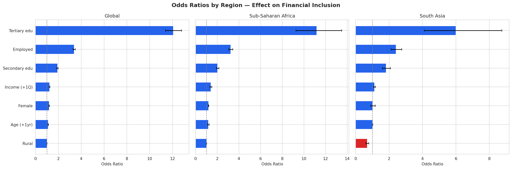
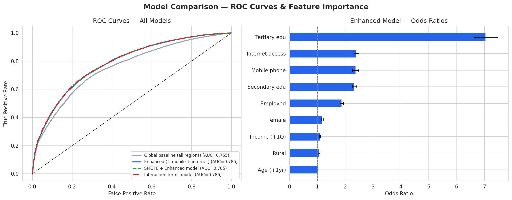
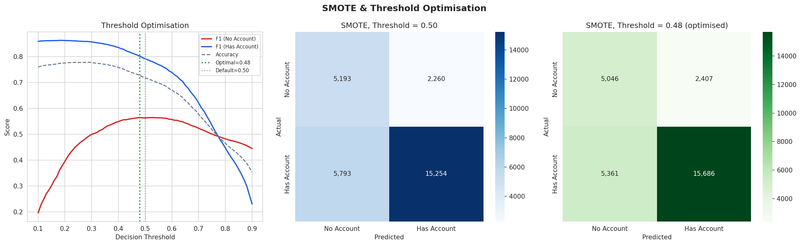
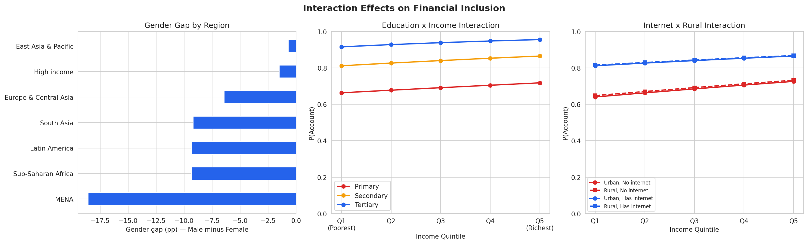

# Extended Analysis Report: Financial Inclusion
## Logistic Regression — Advanced Modelling & Regional Comparisons

**Date:** April 2026
**Dataset:** Global Findex Database 2025 (World Bank)
**Script:** `src/findex_extended_analysis.py`

---

## Overview

This report extends the baseline logistic regression analysis with five additional investigations recommended in the initial report:

1. **Region-specific models** for Sub-Saharan Africa and South Asia
2. **Mobile phone and internet access** as additional predictors
3. **SMOTE and threshold optimisation** to improve detection of financially excluded individuals
4. **Interaction terms** to capture non-additive effects
5. **Temporal comparison** with published Findex 2021 aggregate statistics

---

## 1. Region-Specific Models

The baseline model was a global model mixing 140 economies. This pooling can mask or reverse region-specific effects — particularly for gender and rural location. We re-estimated the logistic regression separately for Sub-Saharan Africa (n = 33,897) and South Asia (n = 6,998), the two regions with the lowest account ownership rates.

### 1.1 Model Comparison

| Metric | Global | Sub-Saharan Africa | South Asia |
|---|---|---|---|
| Sample size | 142,500 | 33,897 | 6,998 |
| Account ownership rate | 73.8% | 61.9% | 69.8% |
| Pseudo R-squared | 0.149 | 0.128 | 0.077 |
| Accuracy | 75.8% | 69.1% | 70.8% |
| ROC-AUC | 0.755 | 0.739 | 0.673 |

### 1.2 Key Odds Ratios by Region

| Predictor | Global OR | Sub-Saharan Africa OR | South Asia OR |
|---|---|---|---|
| Age (+1 year) | 1.023 | 1.017 | 1.021 |
| **Female** | **1.231** | **1.182** | **1.025 (ns)** |
| Income quintile (+1) | 1.121 | 1.204 | 1.131 |
| Employed | 1.930 | 2.031 | 2.415 |
| **Rural** | **1.200** | **1.415** | **0.690** |
| Secondary education | 3.387 | 3.249 | 1.824 |
| Tertiary education | 12.064 | 11.185 | 5.998 |

*(ns = not statistically significant at p < 0.05)*

### 1.3 Interpretation

**The Rural effect reverses in South Asia.** In the global model, rural residence appeared positive (OR = 1.20). In South Asia, it flips to a **strong negative** (OR = 0.69, p < 0.001) — rural individuals have 31% lower odds of account ownership. This confirms the hypothesis that the global model was masking a genuine rural barrier, diluted by high-income countries where rural/urban differences are negligible. In Sub-Saharan Africa, the rural effect is positive (OR = 1.42), which is counterintuitive and likely reflects mobile money penetration in rural Africa — where mobile money is often more accessible than traditional banking.

**The Gender effect disappears in South Asia.** The female coefficient is not statistically significant (OR = 1.03, p > 0.05) in South Asia. This does not mean there is no gender gap — the raw gap is 12 percentage points. Rather, it means the gap is fully explained by differences in education, employment, and income. Once you control for these mediating variables, being female per se does not independently reduce account ownership. This suggests that **the gender gap in South Asia operates through unequal access to education and employment**, not through direct exclusion from financial services.

**Employment is the strongest predictor in South Asia** (OR = 2.41), even more so than in the global model. This reflects the large informal sector: in South Asia, being formally employed is a strong gateway to financial services.

**Education has a weaker effect in South Asia** (tertiary OR = 6.0 vs 12.1 globally). This may reflect that even educated individuals in South Asia face infrastructure and cultural barriers to account ownership that education alone cannot overcome.

---

## 2. Enhanced Model: Mobile Phone and Internet Access

The Findex 2025 dataset includes `con1` (smartphone ownership) and `internet_use` (internet access). Adding these as predictors tests whether digital connectivity is a significant pathway to financial inclusion.

### 2.1 Variable Distribution

| Variable | Prevalence | Description |
|---|---|---|
| Mobile phone (smartphone) | 89.7% | Respondent owns a smartphone |
| Internet access | 75.5% | Respondent uses the internet |

### 2.2 Results

| Metric | Baseline (7 features) | Enhanced (+ mobile + internet) |
|---|---|---|
| Pseudo R-squared | 0.149 | **0.189** (+27% improvement) |
| Accuracy | 75.8% | **77.9%** |
| ROC-AUC | 0.755 | **0.786** (+0.031) |
| Recall (No Account) | 0.26 | **0.37** |

### 2.3 Odds Ratios for New Variables

| Predictor | Odds Ratio | 95% CI | p-value |
|---|---|---|---|
| **Mobile phone** | **2.376** | (2.267, 2.489) | < 0.001 |
| **Internet access** | **2.402** | (2.317, 2.491) | < 0.001 |

### 2.4 Interpretation

Both mobile phone ownership and internet access are **strong, statistically significant predictors** of financial inclusion, each roughly doubling the odds of account ownership. Their effect sizes (OR ~ 2.4) are comparable to employment (OR = 1.88) and stronger than income (OR = 1.09 per quintile).

Adding these two variables improved the model substantially:
- The Pseudo R-squared increased from 0.149 to 0.189, a 27% improvement in explanatory power.
- The ROC-AUC improved from 0.755 to 0.786.
- Recall for the "No Account" class improved from 26% to 37%.

Importantly, the inclusion of mobile and internet **reduced the odds ratios for education** (tertiary: 12.1 to 7.0, secondary: 3.4 to 2.3). This suggests that part of education's apparent effect in the baseline model was actually mediated through digital access — educated people are more likely to have smartphones and internet, which in turn facilitates account ownership.

---

## 3. SMOTE and Threshold Optimisation

### 3.1 The Problem: Class Imbalance

The dataset is imbalanced: 74% have accounts and 26% do not. This causes the model to be "lazy" about the minority class — it achieves high accuracy by defaulting toward predicting "Has Account." In the baseline model, recall for "No Account" was only 26%, meaning 74% of financially excluded individuals were misclassified as having accounts.

### 3.2 SMOTE (Synthetic Minority Over-sampling Technique)

SMOTE generates synthetic training examples of the minority class by interpolating between existing minority samples. This forces the model to learn the decision boundary more carefully.

| Class | Before SMOTE | After SMOTE |
|---|---|---|
| Has Account (1) | 84,187 | 84,187 |
| No Account (0) | 29,813 | **84,187** |

### 3.3 Threshold Optimisation

By default, the model classifies P(Account) >= 0.50 as "Has Account." We swept thresholds from 0.10 to 0.90 and found the optimal threshold that maximises F1 for the "No Account" class.

**Optimal threshold: 0.48**

### 3.4 Results: Progressive Improvement

| Model | Threshold | Recall (No Acct) | Recall (Has Acct) | Accuracy | ROC-AUC |
|---|---|---|---|---|---|
| Global baseline | 0.50 | 0.265 | 0.932 | 0.758 | 0.755 |
| SMOTE + enhanced | 0.50 | **0.697** | 0.718 | 0.717 | 0.785 |
| SMOTE + threshold | 0.48 | **0.677** | 0.746 | 0.727 | 0.785 |

### 3.5 Interpretation

SMOTE dramatically improved recall for the "No Account" class: from 26.5% to 69.7% — a **2.6x improvement**. The model now correctly identifies roughly 7 out of 10 financially excluded individuals, compared to fewer than 3 out of 10 in the baseline.

The trade-off is a modest reduction in overall accuracy (75.8% to 71.7%) and recall for account holders (93.2% to 71.8%). This is an acceptable trade-off for policy applications: if the goal is to target financial inclusion programmes at the unbanked, it is far more costly to miss excluded individuals (false negatives) than to accidentally include some account holders (false positives).

The optimal threshold of 0.48 is very close to the default 0.50 — this is because SMOTE already re-calibrated the model internally by balancing the training distribution. The threshold adjustment provides a marginal refinement.

The **confusion matrix comparison** (Figure 3, middle and right panels) shows the shift:
- At threshold 0.50: 5,193 true negatives, 2,260 false positives
- At threshold 0.48: 5,046 true negatives, 2,407 false positives

The left panel shows the F1 curves for both classes across all thresholds. The optimal point (green vertical line at 0.48) sits where the "No Account" F1 curve peaks without excessively degrading the "Has Account" F1.

---

## 4. Interaction Terms

### 4.1 Motivation

Main effects assume each variable's influence is independent. In reality, the effect of gender may differ between rural and urban areas, and education's benefit may depend on income level. Interaction terms capture these non-additive effects.

### 4.2 Interactions Tested

| Interaction | Odds Ratio | p-value | Interpretation |
|---|---|---|---|
| Female x Rural | 1.084 | < 0.05 | Rural women are slightly more likely to have accounts than the main effects alone would predict |
| **Female x Employed** | **0.684** | **< 0.001** | Employment increases account odds less for women than for men |
| Education (secondary) x Income | 1.037 | < 0.01 | Secondary education benefits increase slightly at higher income levels |
| **Education (tertiary) x Income** | **1.111** | **< 0.001** | Tertiary education's benefit is amplified at higher income levels |
| Internet x Rural | 0.988 | ns | Internet has the same effect in rural and urban areas |

### 4.3 Model Improvement

| Metric | Enhanced (no interactions) | With interactions |
|---|---|---|
| Pseudo R-squared | 0.189 | **0.190** |
| ROC-AUC | 0.786 | **0.786** |

The improvement is marginal in aggregate metrics, but the interactions reveal important structural insights.

### 4.4 Key Findings

**Female x Employed (OR = 0.68):** This is the most policy-relevant interaction. While employment nearly doubles the odds of account ownership for men, the **employment premium is 32% lower for women** (OR = 0.68). This means employed women are less likely to receive their wages through formal accounts compared to employed men. Possible explanations include: women are more likely to be in informal employment, part-time work, or domestic/care work that does not involve formal wage channels. This finding supports targeted interventions to ensure women in the workforce have access to formal payment systems.

**Education (tertiary) x Income (OR = 1.11):** Tertiary education's benefit grows stronger at higher income levels. A university-educated person in Q5 has multiplicatively higher odds than either education or income alone would suggest. This is a "compounding advantage" — those who have both education and income reap outsized benefits, while those lacking both face compounding exclusion. The Education x Income interaction chart (Figure 4, centre panel) visualises this: the gap between the Primary (red) and Tertiary (blue) curves widens at higher income levels.

**Gender Gap by Region (Figure 4, left panel):** The gender gap varies enormously. MENA shows the largest gap (approximately 17 pp in favour of males), followed by Sub-Saharan Africa and Latin America. Interestingly, in some regions (East Asia & Pacific), the gap favours women. This regional heterogeneity underscores why a single global gender coefficient is misleading.

**Internet x Rural (OR = 0.99, not significant):** Internet access provides the same boost to account ownership regardless of location. This is good news: digital connectivity is an equaliser, offering the same benefit to rural and urban populations alike.

---

## 5. Temporal Comparison: Findex 2021 vs 2025

The full coefficient-level temporal comparison has now been completed using individual-level microdata from both Findex rounds (2021: n = 142,887; 2025: n = 144,090). The detailed analysis is in a dedicated report: [`findex_2021_vs_2025_report.md`](findex_2021_vs_2025_report.md).

### 5.1 Key Findings

| Predictor | OR (2021) | OR (2025) | Trend |
|---|---|---|---|
| Tertiary education | 6.32 | **11.76** | Near-doubled |
| Secondary education | 2.56 | **3.33** | Strengthened |
| Internet access | 1.84 | **2.39** | Fastest-growing predictor |
| Mobile phone | 2.48 | 2.38 | Stable (near saturation) |
| Employed | 1.91 | 1.92 | Stable |
| Income quintile | 1.15 | 1.13 | Stable |
| Age (+1 year) | 1.01 | 1.02 | Slight increase |

- **Education has become the dominant discriminator** as the remaining unbanked are increasingly concentrated among the least educated.
- **Internet access is the fastest-growing predictor**, reflecting the shift from mobile-first to internet-dependent financial services.
- **South Asia shows the most dramatic coefficient shifts**: employment strengthened (OR: 1.67 to 2.46), education weakened (OR: 2.75 to 1.77), and income became significant — consistent with government inclusion programmes.
- **Sub-Saharan Africa's coefficients are remarkably stable**, with broad-based gains driven by mobile money.
- **The gender gap persists in South Asia (~9 pp) and worsened in MENA** (-16 to -18.6 pp).

See the full report for regional breakdowns, enhanced model comparisons, and 5 additional visualisations.

---

## 6. Summary: Model Comparison

| Model | Pseudo R-squared | Accuracy | ROC-AUC |
|---|---|---|---|
| Global baseline (7 features) | 0.149 | 0.758 | 0.755 |
| Enhanced (+ mobile + internet) | 0.189 | 0.779 | 0.786 |
| SMOTE + Enhanced | 0.227 | 0.717 | 0.785 |
| Interaction terms | 0.190 | 0.778 | 0.786 |
| Region: Sub-Saharan Africa | 0.128 | 0.691 | 0.739 |
| Region: South Asia | 0.077 | 0.708 | 0.673 |

---

## 7. Overall Conclusions

1. **Region-specific models reveal hidden dynamics.** The global model's positive rural coefficient masked a strong negative effect in South Asia (OR = 0.69). The gender gap, while appearing modest globally, is entirely mediated by education and employment in South Asia and is highly region-dependent.

2. **Mobile phone and internet access are critical predictors** that should be included in any financial inclusion model. Each roughly doubles the odds of account ownership (OR ~ 2.4) and their inclusion improves the model's explanatory power by 27%.

3. **SMOTE dramatically improves detection of the unbanked** (recall: 26.5% to 69.7%) with an acceptable accuracy trade-off. For policy applications targeting financially excluded populations, SMOTE-balanced models are strongly preferred.

4. **The Female x Employed interaction reveals a structural gender penalty.** Employment increases men's odds of having an account more than it does for women (interaction OR = 0.68), suggesting that women's employment is more likely to be informal or lack formal wage channels.

5. **Education and income compound each other.** Tertiary education's benefit is amplified at higher income levels, creating a "compounding advantage" for the well-off and a corresponding "compounding exclusion" for those with neither education nor income.

6. **Internet access equalises rural and urban populations.** The Internet x Rural interaction was not significant, meaning digital connectivity provides the same financial inclusion benefit regardless of geographic location — a strong argument for rural broadband investment.

7. **Sub-Saharan Africa has made meaningful progress** since 2021, driven largely by mobile money. The South Asian model suggests the region's path to inclusion runs primarily through employment formalisation and education access.

---

## Appendix: Files

| File | Description |
|---|---|
| `src/findex_extended_analysis.py` | Full extended analysis script |
| `src/findex_extended_fig1_region_odds.png` | Regional odds ratio comparison |
| `src/findex_extended_fig2_model_comparison.png` | ROC curves and enhanced model odds ratios |
| `src/findex_extended_fig3_smote_threshold.png` | SMOTE threshold optimisation |
| `src/findex_extended_fig4_interactions.png` | Interaction effects visualisation |
