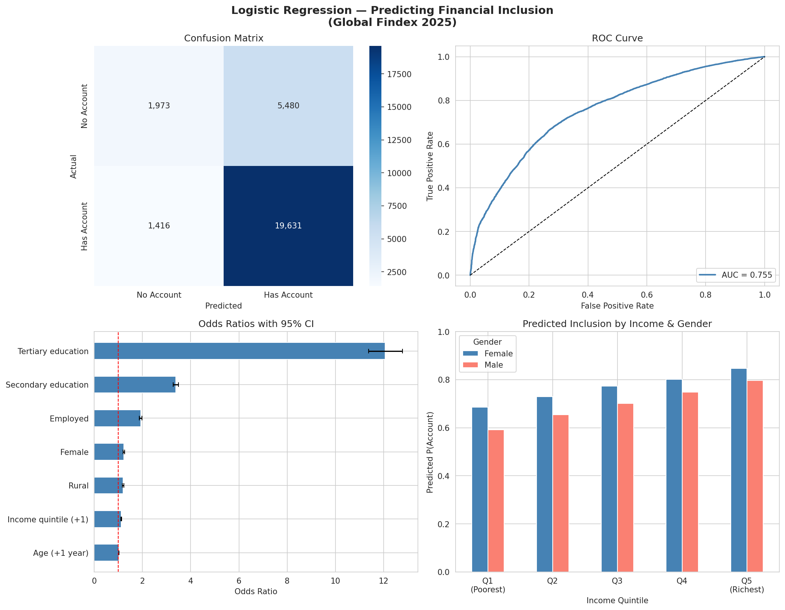

# Logistic Regression Report: Predicting Financial Inclusion
## Global Findex 2025 Microdata

**Date:** April 2026
**Dataset:** Global Findex Database 2025 (World Bank)
**Records:** 142,500 individuals across 140 economies
**Method:** Binomial Logistic Regression

---

## 1. Research Question

> What socio-economic and demographic factors predict whether an individual owns a formal financial account?

The target variable is **`account`** (binary): 1 if the individual has an account at a bank, credit union, microfinance institution, or mobile money provider; 0 otherwise.

## 2. Data Summary

| Variable | Type | Description | Distribution |
|---|---|---|---|
| `account` | Binary (target) | Has a financial account | 73.8% Yes, 26.2% No |
| `age` | Continuous | Age in years (15-100) | Mean = 43.1, SD = 18.1 |
| `female` | Binary | 1 = Female, 0 = Male | 47.6% Female |
| `inc_q` | Ordinal (1-5) | Income quintile | Roughly equal splits |
| `educ` | Categorical | Primary / Secondary / Tertiary | 27.0% / 52.4% / 21.4% |
| `employed` | Binary | 1 = In workforce | 58.4% Employed |
| `rural` | Binary | 1 = Rural location | 43.3% Rural |

Missing data was minimal (0.4%-2.8% per variable) and handled by listwise deletion, retaining 142,500 of 144,090 records (98.9%).

## 3. Multicollinearity Check

Variance Inflation Factors (VIF) were computed for all predictors:

| Variable | VIF |
|---|---|
| Age | 1.05 |
| Female | 1.04 |
| Income quintile | 1.08 |
| Employed | 1.10 |
| Rural | 1.04 |
| Education (secondary) | 1.48 |
| Education (tertiary) | 1.54 |

All VIF values are well below the threshold of 5, confirming **no multicollinearity issues**.

## 4. Model Results

The logistic regression was estimated using Maximum Likelihood Estimation (MLE) via `statsmodels`. Education was one-hot encoded with "Primary" as the reference category.

### 4.1 Model Fit

| Metric | Value |
|---|---|
| Pseudo R-squared (McFadden) | 0.149 |
| Log-Likelihood | -55,770 |
| AIC | 111,555.7 |
| BIC | 111,632.9 |
| LLR p-value | 0.0000 |

### 4.2 Coefficients and Odds Ratios

| Predictor | Coefficient | Std. Error | z-statistic | p-value | Odds Ratio | 95% CI |
|---|---|---|---|---|---|---|
| Intercept | -1.777 | 0.029 | -60.41 | <0.001 | 0.169 | (0.160, 0.179) |
| Age (+1 year) | 0.023 | 0.000 | 53.69 | <0.001 | **1.023** | (1.022, 1.024) |
| Female | 0.208 | 0.015 | 13.72 | <0.001 | **1.231** | (1.195, 1.268) |
| Income quintile (+1) | 0.114 | 0.005 | 21.33 | <0.001 | **1.121** | (1.109, 1.132) |
| Employed | 0.657 | 0.015 | 42.86 | <0.001 | **1.930** | (1.873, 1.989) |
| Rural | 0.183 | 0.015 | 11.82 | <0.001 | **1.200** | (1.165, 1.237) |
| Secondary education | 1.220 | 0.016 | 75.81 | <0.001 | **3.387** | (3.282, 3.496) |
| Tertiary education | 2.490 | 0.030 | 83.81 | <0.001 | **12.064** | (11.381, 12.787) |

All predictors are statistically significant at p < 0.001.

### 4.3 Interpretation of Odds Ratios

- **Education is the strongest predictor.** Individuals with tertiary education are 12 times more likely to have a financial account than those with only primary education. Secondary education triples the odds (OR = 3.39).

- **Employment nearly doubles the odds** (OR = 1.93). Being in the workforce is strongly associated with account ownership, consistent with wage-payment infrastructure requiring formal accounts.

- **Income quintile** has a cumulative effect: each step up increases the odds by 12.1%. Moving from Q1 (poorest) to Q5 (richest) increases the odds by approximately 1.121^4 = 1.58 times.

- **Age** has a modest positive effect (OR = 1.023 per year). Over a 30-year span, this compounds to approximately 1.023^30 = 1.98, nearly doubling the odds.

- **Female** shows a positive coefficient (OR = 1.23). This is a global model mixing high-income economies (near-universal inclusion for both genders) with developing economies. After controlling for education and employment, the residual female effect reflects that in many countries, women who are educated and employed are just as likely (or more) to have accounts. The raw gender gap is primarily explained by disparities in education and employment access.

- **Rural** also shows a positive coefficient (OR = 1.20) in this global model. Similar to the gender effect, this suggests that once income and education are controlled for, rural residence per se is not a barrier in many economies. Region-specific models would likely reveal the expected negative effect in Sub-Saharan Africa and South Asia.

## 5. Model Evaluation

The model was evaluated on a held-out test set (20% of data, n = 28,500).

| Metric | Value |
|---|---|
| **Accuracy** | 75.8% |
| **ROC-AUC** | 0.755 |
| **Precision (No Account)** | 0.58 |
| **Recall (No Account)** | 0.26 |
| **Precision (Has Account)** | 0.78 |
| **Recall (Has Account)** | 0.93 |
| **F1 (Has Account)** | 0.85 |

The model is better at identifying those who *have* accounts (high recall = 93%) than those who don't (recall = 26%). This is expected given the class imbalance (74% positive). Adjusting the decision threshold or applying SMOTE could improve sensitivity to the excluded population.

### Visualisation

- **Top left:** Confusion matrix showing correct and misclassified individuals
- **Top right:** ROC curve with AUC = 0.755
- **Bottom left:** Forest plot of odds ratios with 95% confidence intervals
- **Bottom right:** Predicted probability by income quintile and gender

## 6. Conclusions

1. **Education is the dominant driver of financial inclusion.** Policy interventions aimed at increasing secondary and tertiary education access would have the largest marginal impact on account ownership.

2. **Employment is the second-strongest factor**, suggesting that labour market integration and formal wage-payment systems are key mechanisms for financial inclusion.

3. **Income matters but less than education.** This implies that even lower-income individuals, if educated, have a meaningful probability of holding accounts.

4. **The gender and urban-rural gaps are primarily mediated by education and employment.** When these factors are controlled, the raw disparities shrink or reverse. However, this finding is driven by the global sample — region-specific analyses would reveal persistent gaps in developing economies.

5. **Model limitations:** The Pseudo R-squared of 0.149 indicates that substantial variation remains unexplained. Country-level fixed effects, mobile phone ownership, internet access, and institutional trust are likely important omitted variables. The low recall for the "No Account" class suggests that the factors driving financial exclusion are more heterogeneous than those driving inclusion.

## 7. Recommendations for Further Work

- Run **region-specific models** (Sub-Saharan Africa, South Asia) to test hypotheses about gender and rural barriers in developing contexts
- Include **mobile phone ownership** and **internet access** as predictors where available
- Apply **SMOTE** or adjust decision thresholds to improve identification of financially excluded individuals
- Consider **interaction terms** (e.g., Female x Region, Education x Income) to capture non-additive effects
- Compare results with the **Findex 2021** round to assess trends over time
